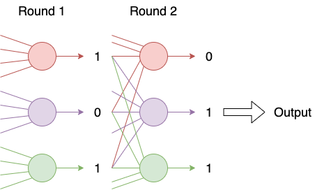
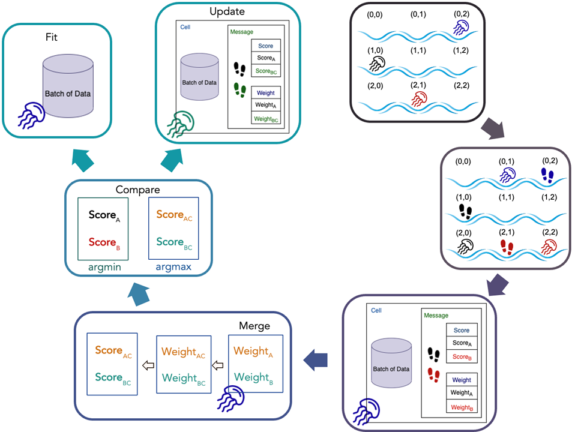

{ align=right }
# Welcome to Chironex Documentation 

## Project Introduction
- This is **Chironex**: 
  A Jellyfish Organism-Inspired Supervised Machine Learning Framework. 

- The project is divided into 2 parts:
    - `sklearn-estimators`
    - `jellyfish-system`

### sklearn-estimators
This is a project is built upon the specification of customized estimators of `scikit-learn`. We implemented the natural behavior of a group of organisms into a pytorch-based neural network.

### jellyfish-system
In this project, we proposed a machine learning framework for supervised learning tasks, which is inspired by the message passing and opinion formation of a group of organisms. 

Specifically, we use jellyfish as the analogy of the deep neural networks, and the environment of the ocean as our dataset. Besides devising and implementing the system to simulate the interaction of the jellyfish and the environment, we also provide a creative mechanism that allows the jellyfish’s prediction of data to converge by looking at other jellyfish’s messages. 

We validated our Chironex framework using the Titanic dataset and compared the accuracy against a Multilayer Perceptron (MLP) implemented using sklearn, a popular machine learning framework. Though the experiment result shows little performance advantage over the traditional ones, the future direction of this project would highlight the improvement of accuracy as well as the convergence of the predictions of the jellyfish swarm. 

Furthermore, the resulting pre-trained jellyfish will be deployed into team Atolla’s cellular automaton environment, whose goal is to observe the evolution of the jellyfish species and the convergence of the environmental state. The higher goal of this joint project is to explain some phenomenon that arises in a complicated social network.

---

## Documentation Introduction
- For `sklearn-estimators`:
    - `Usage`: How to use sklearn-estimators
    - `Design`: The design implementation details with function descriptions and code
- For `jellyfish-system`:
    - `Usage`: How to use Jellyfish system on classfication problems
    - `Design`: The design implementation details with function descriptions and code

